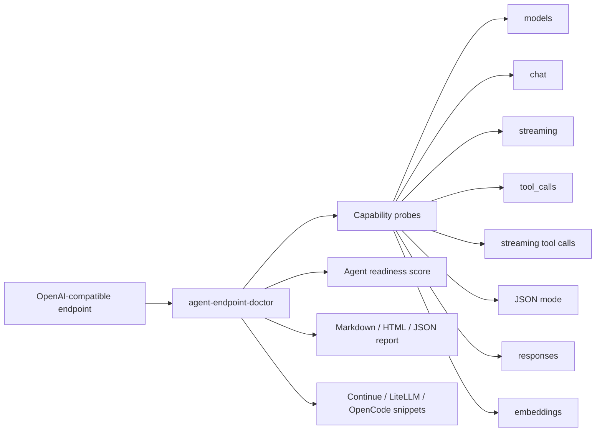
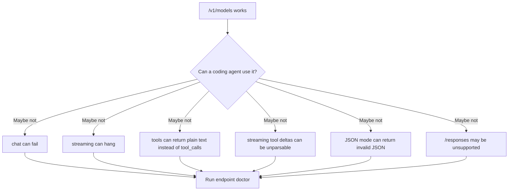
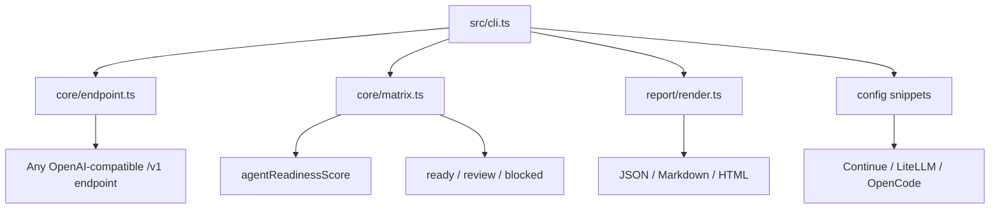

# agent-endpoint-doctor

> Local compatibility evidence for OpenAI-compatible endpoints used by AI coding agents.

[](https://github.com/Gowrav-M/agent-endpoint-doctor/actions/workflows/ci.yml)
[](LICENSE)
[](package.json)

Many providers say "OpenAI-compatible." Coding agents need more than that. They need chat, streaming, tool calls, streaming tool-call deltas, JSON mode, `/responses`, embeddings, and client-readable response shapes.

`agent-endpoint-doctor` answers one question:

> Can I safely point my coding agent at this endpoint?

```bash
npx agent-endpoint-doctor demo
```

The demo is offline and writes reports under `.endpoint-doctor/`.

## Visual Map



## Why This Exists



## What It Tests

| Capability | Why it matters |
| --- | --- |
| `/v1/models` | Client can discover or validate model IDs |
| `/v1/chat/completions` | Basic agent conversation path |
| streaming | IDEs and agents often stream partial output |
| `tool_calls` | Coding agents need structured tool use |
| streaming tool calls | Tool-heavy agent workflows often fail here |
| JSON mode | Evals, config generation, and automation need parseable output |
| `/v1/responses` | Some modern clients use the Responses API |
| `/v1/embeddings` | Retrieval and code search workflows need vectors |

## Quick Start

```bash
# Offline proof
npx agent-endpoint-doctor demo

# Test a local or hosted OpenAI-compatible endpoint
npx agent-endpoint-doctor test \
  --base-url http://localhost:1234/v1 \
  --model qwen3-coder

# Print saved matrix
npx agent-endpoint-doctor matrix

# Generate Continue/LiteLLM/OpenCode snippets
npx agent-endpoint-doctor config \
  --base-url http://localhost:1234/v1 \
  --model qwen3-coder

# Render reports
npx agent-endpoint-doctor report
```

PowerShell with a provider key:

```powershell
$env:OPENAI_COMPATIBLE_API_KEY="sk-or-provider-key"
cmd /c npx -y agent-endpoint-doctor test --base-url https://example.com/v1 --model model-id
```

## Example Matrix

```text
offline-localhost-demo
----------------------
Decision: REVIEW | Agent readiness: 75/100
[PASS] models: Endpoint lists models.
[PASS] chat: Endpoint accepted a chat completion request.
[PASS] streaming: Endpoint returned SSE-style streaming data.
[PASS] tools: Endpoint returned OpenAI-style message.tool_calls.
[FAIL] streaming_tools: Endpoint did not stream recognizable tool-call deltas.
[PASS] json_mode: Endpoint returned parseable JSON content.
[FAIL] responses: Endpoint does not implement /responses.
[FAIL] embeddings: Chat model does not expose /embeddings.
```

## Architecture



## Output Files

```text
.endpoint-doctor/
  configs/
    continue.yaml
    litellm.yaml
    opencode.json
  reports/
    compatibility-matrix.json
    endpoint-doctor-report.json
    endpoint-doctor-report.md
    endpoint-doctor-report.html
```

## Not A Router

This project does not proxy traffic or route requests. LiteLLM, OpenRouter-style gateways, provider SDKs, and local runtimes already handle routing.

`agent-endpoint-doctor` is the preflight check before you trust an endpoint inside an agent workflow.

Research notes: [docs/research.md](docs/research.md)

## Safety

Do not send private source code, customer data, secrets, medical data, financial data, or regulated data to a provider unless your organization and the provider terms allow it. The test prompts are intentionally tiny, but the endpoint still receives requests during live tests.

## Development

```bash
npm install
npm run typecheck
npm test
npm run lint
npm run build
node dist/cli.js demo
```

## License

MIT
